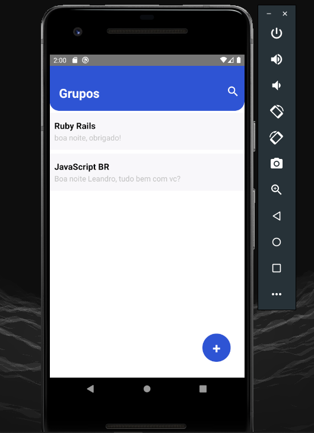
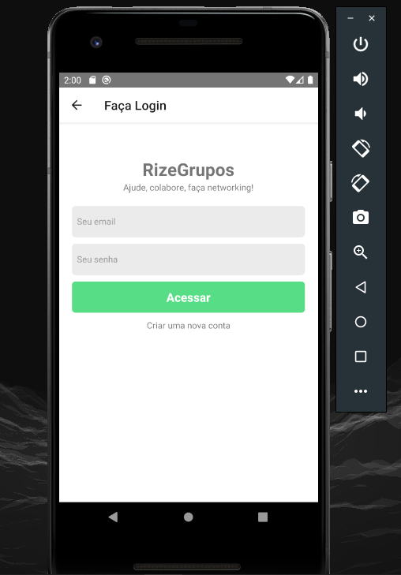
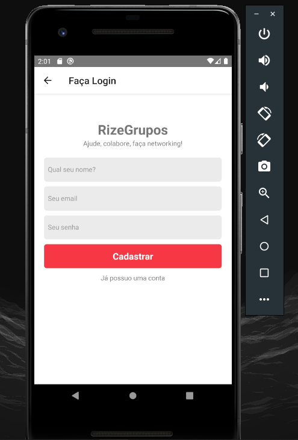
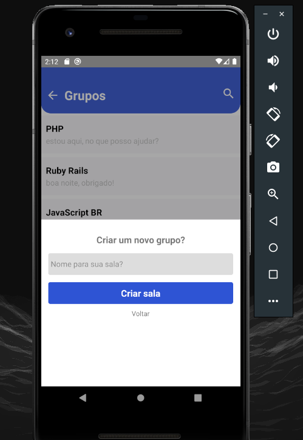
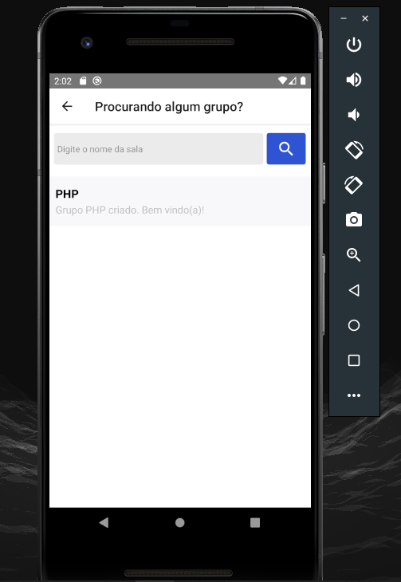
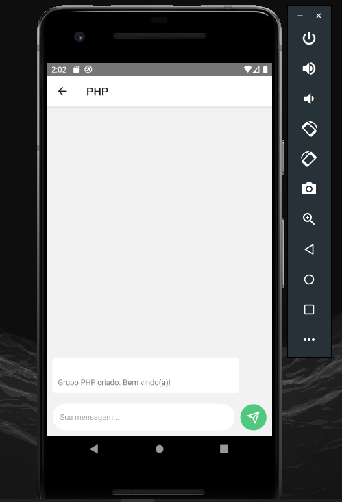
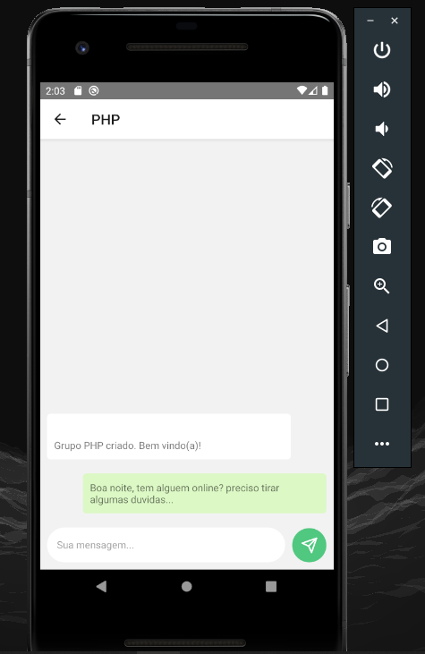
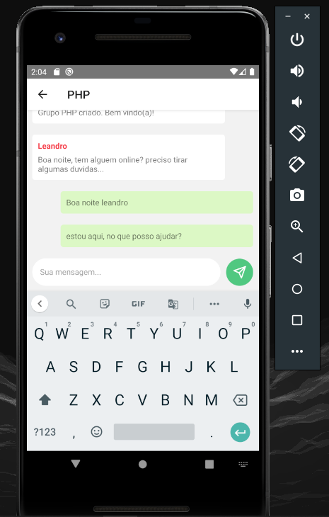
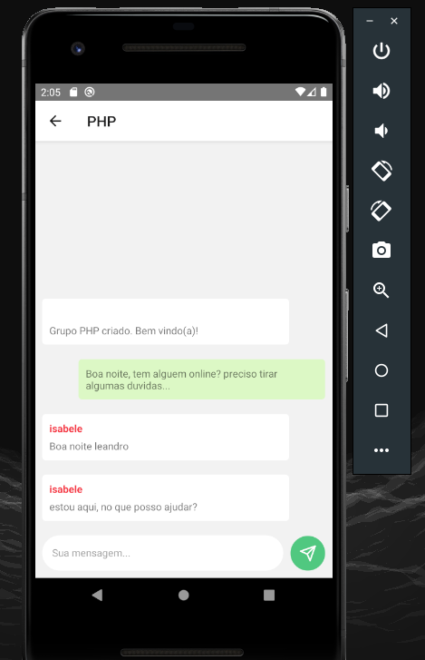

# Visualização


https://user-images.githubusercontent.com/88807757/160320023-bf7cdce7-8a4e-4875-b20a-21d63559a4ea.mp4


# Aplicação  RizeGrupos

**React Native App - rizegrupos** using **Firebase**, **StyleSheet**, **React Navigation**

## Resumo

O aplicativo RizeGrupos, é uma aplicação bem legal e completa. Basicamente é um chat online, mas de grupos,
o usuário pode criar salas distintas e entrar em outras salas criadas por outras pessoas, podendo conversar em
realtime.<br>
O usuário pode entrar no aplicativo e poderá ver os grupos criados, caso ele nao esteja logado e clique
em algum grupo, será redirecionado para o login,<br>
caso não tenha login, o usuário pode fazer o cadastro.
Se o usuário já estiver logado, ele pode entrar no grupo e conversar no chat.<br>
Pode ser criado até três grupos por usuário, caso deseje deletar, é simples, basta apertar e segurar no grupo criado pelo o usuário e confirmar para deletar.

## Running

Clone the repository.

```bash
git clone https://github.com/ribeiro-le/RizeGrupos-app--react-native.git

```

Install the application in your device:

```bash
react-native run-android
```

Na raiz do projeto, execute:

```bash
npx react-native run-android
```

# Install React Navigation

```bash
npm install @react-navigation/native
```

```bash
npm install @react-navigation/native-stack
```

# Installing dependencies

```bash
npm install react-native-screens react-native-safe-area-context
```

# Install React Native Firebase

## Pré-requisitos

Antes de começar, a documentação pressupõe que você possa criar um projeto com React Native e que tenha um projeto Firebase ativo. Se você não atender a esses pré-requisitos, siga os links abaixo:

<ul>
<li><a href="https://reactnative.dev/docs/environment-setup">React Native - Configurando o ambiente de desenvolvimento</a></li>
<li><a href="https://firebase.google.com/?hl=pt">Criar um novo projeto do Firebase</a></li>
</ul>

# Install

A instalação do React Native Firebase requer algumas etapas; instalando o módulo NPM, adicionando os arquivos de configuração do Firebase e reconstruindo seu aplicativo.

## 1.Instale via NPM

Instale o módulo "app" React Native Firebase na raiz do seu projeto React Native com NPM ou Yarn:

```bash
# Using npm
npm install --save @react-native-firebase/app

# Using Yarn
yarn add @react-native-firebase/app
```

O @react-native-firebase/appmódulo deve ser instalado antes de usar qualquer outro serviço do Firebase.

# 2. Configuração do Android

Para permitir que o aplicativo Android se conecte com segurança ao seu projeto do Firebase, um arquivo de configuração deve ser baixado e adicionado ao seu projeto.

# Gerando credenciais do Android

No console do Firebase, adicione um novo aplicativo Android e insira os detalhes do seu projeto. O "nome do pacote Android" deve corresponder ao nome do pacote do seu projeto local, que pode ser encontrado dentro da manifesttag dentro do /android/app/src/main/AndroidManifest.xml arquivo dentro do seu projeto.

```bash
O certificado de assinatura de depuração é opcional para usar o Firebase com seu aplicativo, mas é necessário para links dinâmicos, convites e autenticação por telefone. Para gerar um certificado, execute cd android && ./gradlew signingReport. Isso gera duas chaves variantes. Você precisa copiar as chaves 'SHA1' e 'SHA-256' que pertencem à opção de chave variante 'debugAndroidTest'. Em seguida, você pode adicionar essas chaves às "impressões digitais do certificado SHA" em seu aplicativo no Firebase console.

```

Baixe o google-services.jsonarquivo e coloque-o dentro do seu projeto no seguinte local: /android/app/google-services.json.

# Configurar o Firebase com credenciais do Android

Para permitir que o Firebase no Android use as credenciais, o google-servicesplug-in deve estar ativado no projeto. Isso requer modificação em dois arquivos no diretório Android.

Primeiro, adicione o google-servicesplugin como uma dependência dentro do seu /android/build.gradle arquivo:

```bash
buildscript {
  dependencies {
    // ... other dependencies
    classpath 'com.google.gms:google-services:4.3.10'
    // Add me --- /\
  }
}

```

Por fim, execute o plug-in adicionando o seguinte ao seu /android/app/build.gradlearquivo

```bash
apply plugin: 'com.android.application'
apply plugin: 'com.google.gms.google-services' // <- Add this line

```

# Para a configuração do IOS, basta seguir a documentação

<ul>
<li><a href="https://rnfirebase.io/">Configuração do iOS</a>
</ul>

# Install Firebase Authentication

```bash
npm install @react-native-firebase/auth
```

# Install Firebase Cloud Firestore

```bash
npm install @react-native-firebase/firestore

```

Se você estiver usando uma versão mais antiga do React Native sem suporte para vinculação automática ou deseja integrar em um projeto existente, siga as etapas de instalação manual para iOS e Android .

Se você começou a receber um app:mergeDexDebugerro após adicionar o Cloud Firestore, leia a documentação <a href="https://rnfirebase.io/enabling-multidex">Ativação do Multidex</a> para obter mais informações sobre como resolver esse erro.

# Ativando Multidex

Existem 3 etapas envolvidas na ativação do multidex.

As etapas 1 e 2 dizem ao Gradle para ativar o multidex com uma diretiva e adicionar uma nova dependência.

Abra o /android/app/build.gradlearquivo. Em dependencies, precisamos adicionar o módulo e habilitá-lo dentro do defaultConfig:

```bash
android {
    defaultConfig {
        // ...
        multiDexEnabled true // <-- ADD THIS in the defaultConfig section
    }
    // ...
}

dependencies {
  implementation 'androidx.multidex:multidex:2.0.1'  // <-- ADD THIS DEPENDENCY
}

```

O 3º passo é alterar seu android/app/src/main/java/.../MainApplication.javaarquivo para estender MultiDexApplicationassim:

```bash

// ... all your other imports here
import androidx.multidex.MultiDexApplication; // <-- ADD THIS IMPORT


// Your class definition needs `extends MultiDexApplication` like below
public class MainApplication extends MultiDexApplication implements ReactApplication {

```

Uma vez adicionado, reconstrua seu aplicativo: npx react-native run-android.

## Final Result

## Tela Home

<br>



<br>
<br>

## Tela Login

<br>



<br>
<br>

## Tela Cadastro

<br>



<br>
<br>

## Criando grupo

<br>



<br>
<br>

## Pesquisando grupo

<br>



<br>
<br>

## Chat

<br>



<br>
<br>

## Enviando mensagem

<br>



<br>
<br>

## Chat realtime

<br>



<br>
<br

## Chat realtime

<br>



<br>
<br
